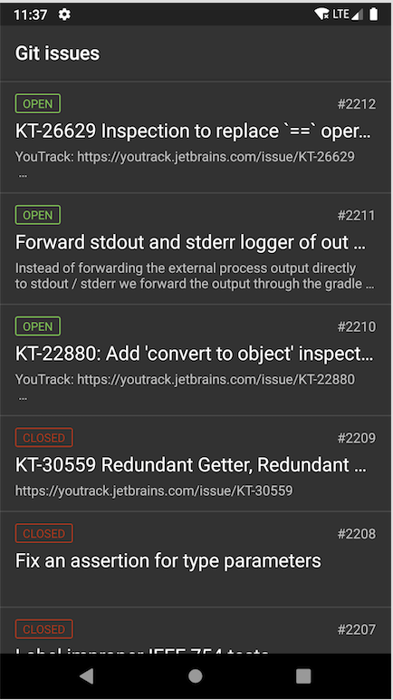
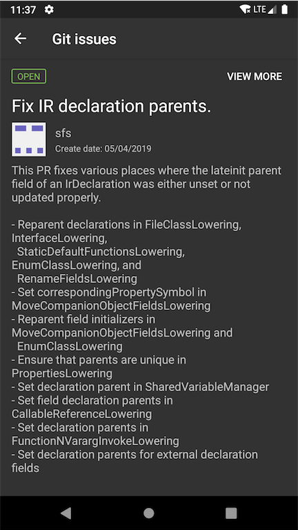

## Objetivo

Desenvolver uma aplicação Android Nativa em Kotlin que consuma a API
do Github Issues ( https://developer.github.com/v3/issues/ ), usando como base o repositório
do kotlin ( https://github.com/JetBrains/kotlin ).

## O aplicativo contem ✓

* Uma tela com a lista de issues do repositório
( https://api.github.com/repos/JetBrains/kotlin/issues ). Cada item da lista deve
conter os seguintes elementos:
    * Título do issue
    * Estado do issue (ABERTO, FECHADO)
* Uma tela mostrando os detalhes do issue que foi selecionado na lista, que deve
conter os seguintes elementos:
    * Título do issue
    * Texto de Descrição do issue
    * Avatar do usuário que criou a issue
    * Data de criação
    * Um botão que abre o browser com o link issue do site do github

## Requisitos
* Escrito em Kotlin ✓
* Injeção de dependência com Dagger2 ✓
* RXJava ✓
* Testes Unitários ✓
* Clean Architecture (MVP) ✓
* Chamadas de REST com Retrofit2 ✓

## ScreenShots

